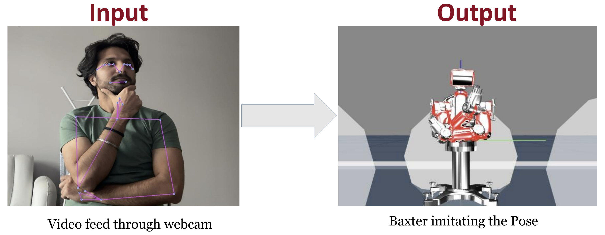
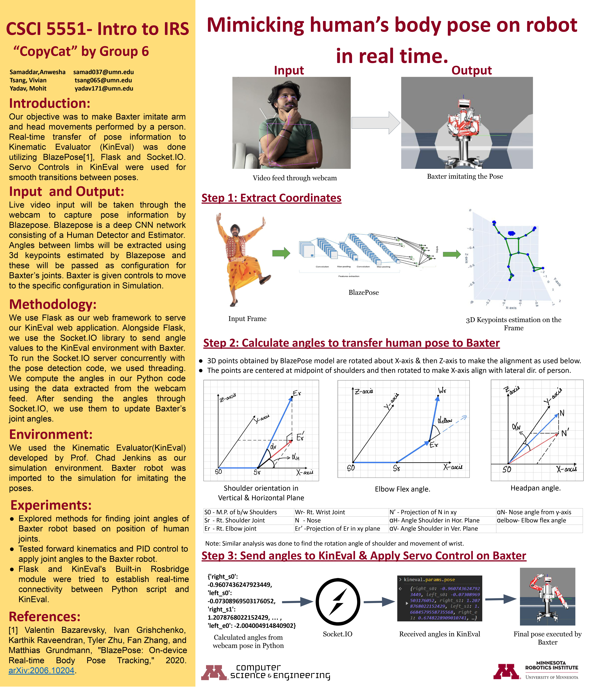

# CopyCat : Real-time Human Pose Imitation on Baxter Robot

## Overview

This repository houses our project for the Course CSCI : 5551 at University of Minnesota. The coursework convered a breath of topics in Intelligent Robotics Systems. Due to Course Policy, we can't share the code for the simulation, we have only included the code written by us to extract the human pose keypoints and implementing the 3D math for mapping the human joint angles to robot joint angles. As part of the coursework we implement code to make our own robot middleware system using the boilerplate code of KinEval(Kinematic Evaluator) designed by Prof. Chad Jenkins from University of Michigan. The topics implemented to create the middleware system included : 

- Forward Kinematics, Robot Modeling
- Robot Choreography with Joint States, Controls, and Finite State Machines
- Pseudoinverse, Jacobian, and Inverse Kinematics
- Path Planning algoritms including Depth-first Search, Breadth-first Search
- RRT, RRT Connect and Collision Detection
- Mobile Manipulation with RRT-Connect, Inverse Kinematics, and Finite State Machines.

For our final project, CopyCat, our aim was to mimic human poses with a Baxter robot. 
See the project demo at [CopyCat](https://mohitydv09.github.io/copycat/).

Below project poster describes the work done for the project.

The repository includes pose.py for capturing webcam feeds, extracting keypoints, and calculating joint angles. However, simulation code isn't provided due to course policy. 
Our implementation was robust, allowing real-time pose imitation for any person, demonstrated during our presentation session.

Video of Project in action :

https://github.com/mohitydv09/copycat/assets/101336175/66eb51d3-7792-47a1-980f-fddee613950e

Credits:

Prof. Karthik Desingh, University of Minnesota for Coursework of CSCI:5551 Fall 2023.

Prof. Odest Chadwicke Jenkins, University of Michigan for KinEval robotics simulator.
